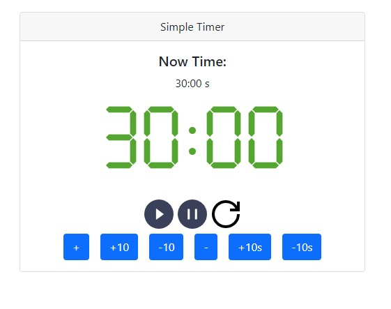
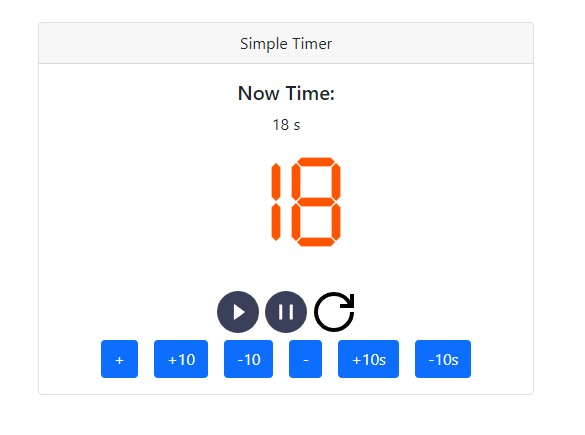
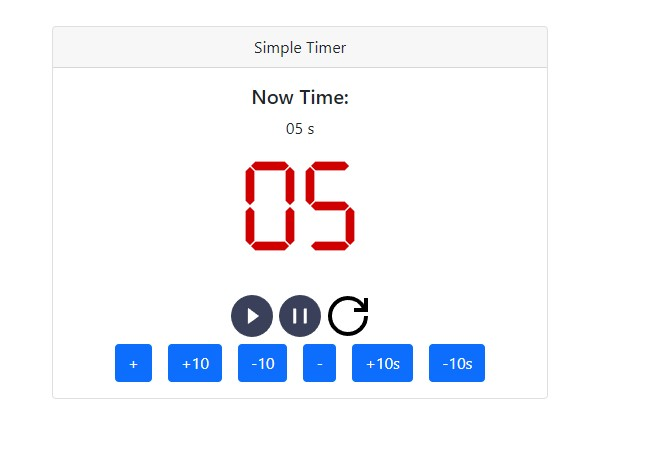
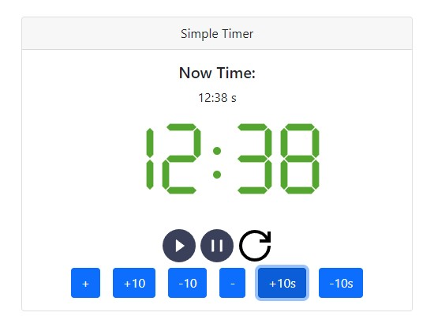

# Simple Timer App
A very simple timer app that can help you know the time left.

## Appreciation

* This project was bootstrapped with [Create React App](https://github.com/facebook/create-react-app).
* My icon is generated and converted with:
	- https://romannurik.github.io/AndroidAssetStudio/index.html
	- https://favicon.io/favicon-converter/
* Alarm Sound Effect:
	- https://pixabay.com/sound-effects/
* Beautiful and Simple `useAudio` solution thanks to [Thomas Hennes](https://stackoverflow.com/users/5438616/thomas-hennes)'s [answer](https://stackoverflow.com/questions/47686345/playing-sound-in-react-js#answer-47686478) on [StackOverflow](https://stackoverflow.com/)
* Great [7-segment svg](https://commons.wikimedia.org/wiki/File:7-segment_abcdefg.svg) from wikimedia commons
* Color choosing with [Coolers](https://coolors.co/)
* And all dependencies including
	- moment.js
	- moment-duration-format
	- bootstrap
	- react-bootstrap

## Features

### Freely pause and resume
You can pause the timer in any time and also resume in any time. The timer will count correctly.
### Colorful digits.
The timer's number will turn orange when the remaining time is less than 1 mins. And turn red when it is less then 10 secs.
### Adding/Subtracting timer when counting
You can freely increase and decrease the value of the timer even when the timer is counting.
### 7-segment displaying using PURE css.
With css `visible: hidden`, I display the total 10 digits and the minus sign `-` as 7-segment style by pure css styles and classes.

## Screen Shots

## Available Scripts

In the project directory, you can run:

### `npm start`

Runs the app in the development mode.\
Open [http://localhost:3000](http://localhost:3000) to view it in your browser.

The page will reload when you make changes.\
You may also see any lint errors in the console.

### `npm test`

Launches the test runner in the interactive watch mode.\
See the section about [running tests](https://facebook.github.io/create-react-app/docs/running-tests) for more information.

### `npm run build`

Builds the app for production to the `build` folder.\
It correctly bundles React in production mode and optimizes the build for the best performance.

The build is minified and the filenames include the hashes.\
Your app is ready to be deployed!

See the section about [deployment](https://facebook.github.io/create-react-app/docs/deployment) for more information.
